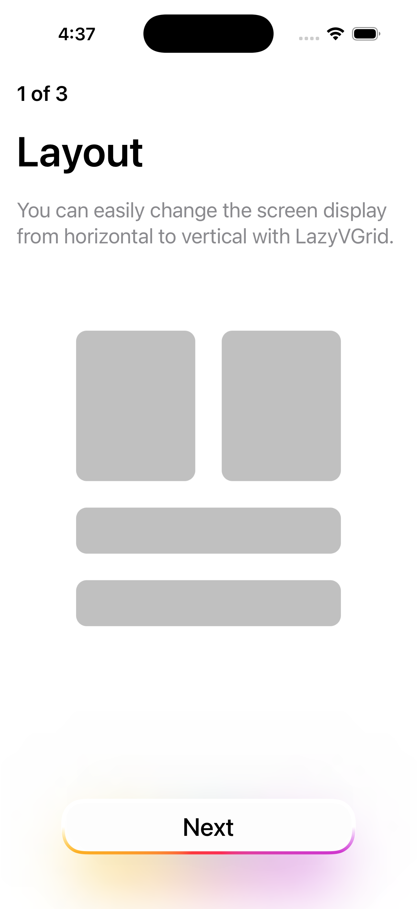
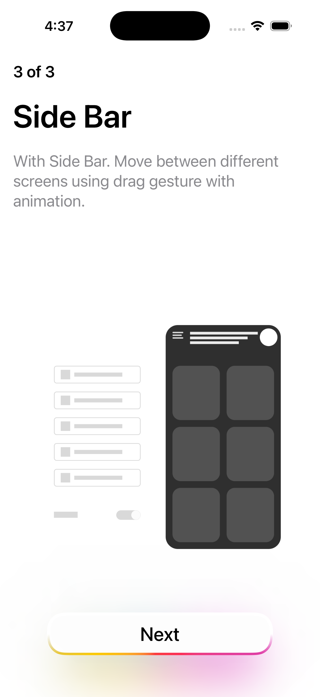
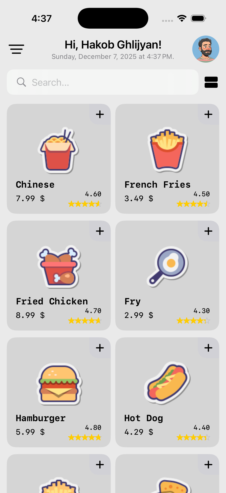
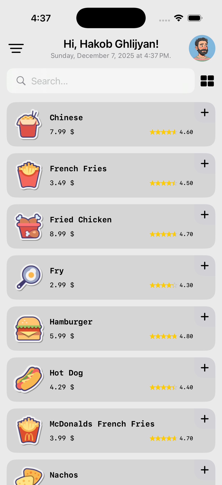
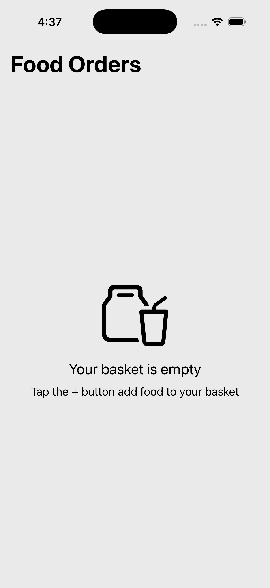
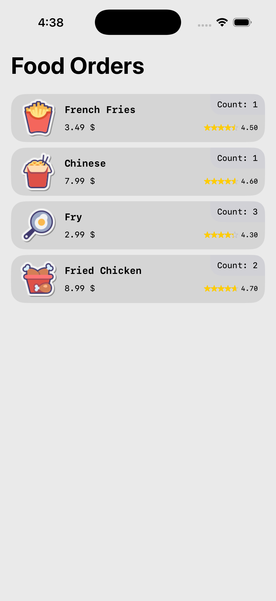
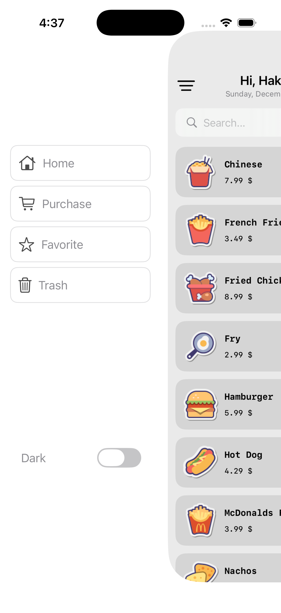
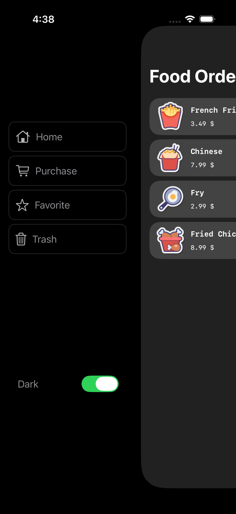
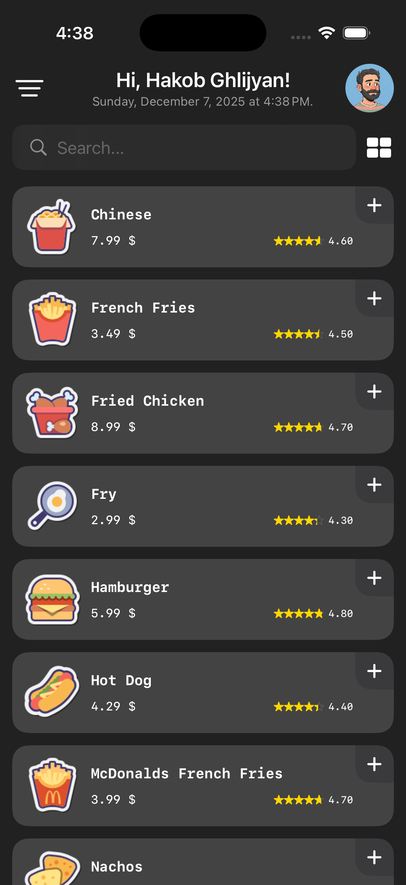

# FoodAppSwiftUI 🍔📱

**FoodAppSwiftUI** — это интерактивное iOS-приложение, демонстрирующее функционал корзины покупок, сетку и список товаров,
а также современный интерфейс с боковым меню и системой онбординга.
Приложение полностью написано на **SwiftUI**, с поддержкой **iOS 16+**.

---

## 📌 Основные возможности

- Просмотр списка еды в **сетки или списке**.
- **Фильтрация продуктов** через поиск по названию.
- Добавление продуктов в **корзину** с подсчетом количества и общей суммы.
- **Интерактивная корзина** (`PurchaseCard`) с динамическими рядами (`PurchaseCardRow`) и подсчетом количества.
- **Сайд-меню** с переключением вкладок: Home, Purchase, Favorite, Trash.
- **Онбординг** при первом запуске приложения.
- **Поддержка Light и Dark** тем.
- Анимации через `TabViewContentWrapper`, масштабирование и плавное перемещение экрана при открытии бокового меню.
- **Кастомные UI-компоненты**: `GlowGradientButton`, `SideViewButton`, `RoundedCorner`.

---
## 🔹 Видео-демонстрация
<!-- Или, если у вас короткий GIF -->

---

## 🖼 Превью UI 🔹 Скриншоты

  
  
  

  
  

  
  

  

  
  

- **GridRowView** — отображение продукта в сетке.
- **ListRowView** — отображение продукта в списке.
- **PurchaseCardRow** — отображение продукта в корзине с количеством.
- **GlowGradientButton** — кнопка с градиентной анимацией.
- **SideView** — боковое меню с кнопками навигации и переключением темы.

---

## ⚡ Технологии

- **Swift 5.9**
- **SwiftUI**
- `@State`, `@Binding`, `@ObservedObject`, `@StateObject` для управления состояниями
- `@Environment(\.colorScheme)` для Light/Dark режимов
- `@Namespace` и `matchedGeometryEffect` для плавных анимаций
- `AppStorage` для сохранения темной темы
- `LazyVGrid`, `ScrollView`, `ForEach` для списков и сеток
- Кастомные `Shape` и `ViewModifiers` (`RoundedCorner`, `topPaddingForDevice`)

---

## 🛠 Архитектура

Приложение использует простую MVVM-подобную архитектуру:

Model:
FoodItem.swift
OnboardingItem.swift
PurchaseCard.swift

View:
ContentView.swift
HomeView.swift
PurchaseCardView.swift
GridRowView.swift
ListRowView.swift
PurchaseCardRow.swift
OnBoardingView.swift
DetailView.swift
GlowGradientButton.swift
SideView.swift

ViewModifiers / Extensions:
View+EXT.swift
RoundedCorner.swift

- **Модель** (`FoodItem`) хранит данные продукта: имя, цену, рейтинг и изображение.
- **Корзина** (`PurchaseCard`) хранит добавленные продукты, их количество и общую стоимость.
- **Контейнер View** (`TabViewContentWrapper`) управляет интерактивными анимациями и трансформациями при свайпах.
- **UI-компоненты** легко переиспользуемы с кастомной анимацией.

📌 License

MIT License © 2025 Hakob Ghlijyan
